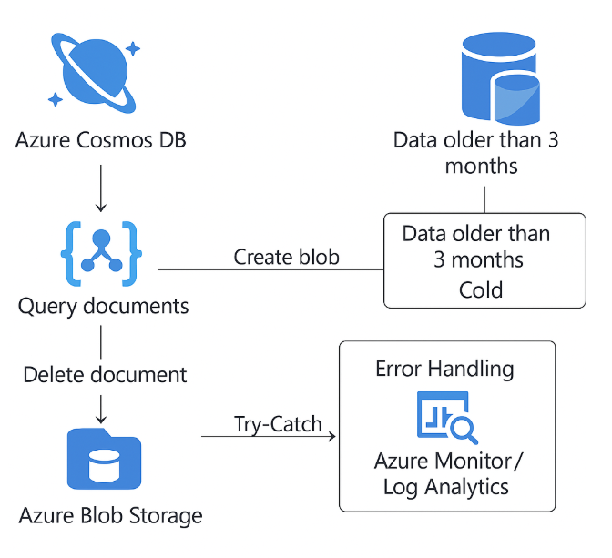

# Azure Cosmos DB Cost Optimization Solution

This repository provides a solution for optimizing costs in Azure Cosmos DB by archiving older billing records to Azure Blob Storage. The approach ensures simplicity, no data loss, and no downtime while maintaining existing API contracts.

## Overview

The solution involves:
- **Data Tiering**: Store recent records in Cosmos DB and archive older records to Azure Blob Storage.
- **Middleware Logic**: Abstract data access to seamlessly retrieve records from either Cosmos DB or Blob Storage.

## Architecture

The architecture includes:
1. **Primary Cosmos DB Container**: Stores recent billing records.
2. **Archive Storage**: Older records are moved to Azure Blob Storage.
3. **Middleware Service**: Abstracts data access for seamless retrieval.

## Implementation Steps

### 1. Data Archival

Move records older than three months from Cosmos DB to Azure Blob Storage periodically.

#### Example Archival Script
